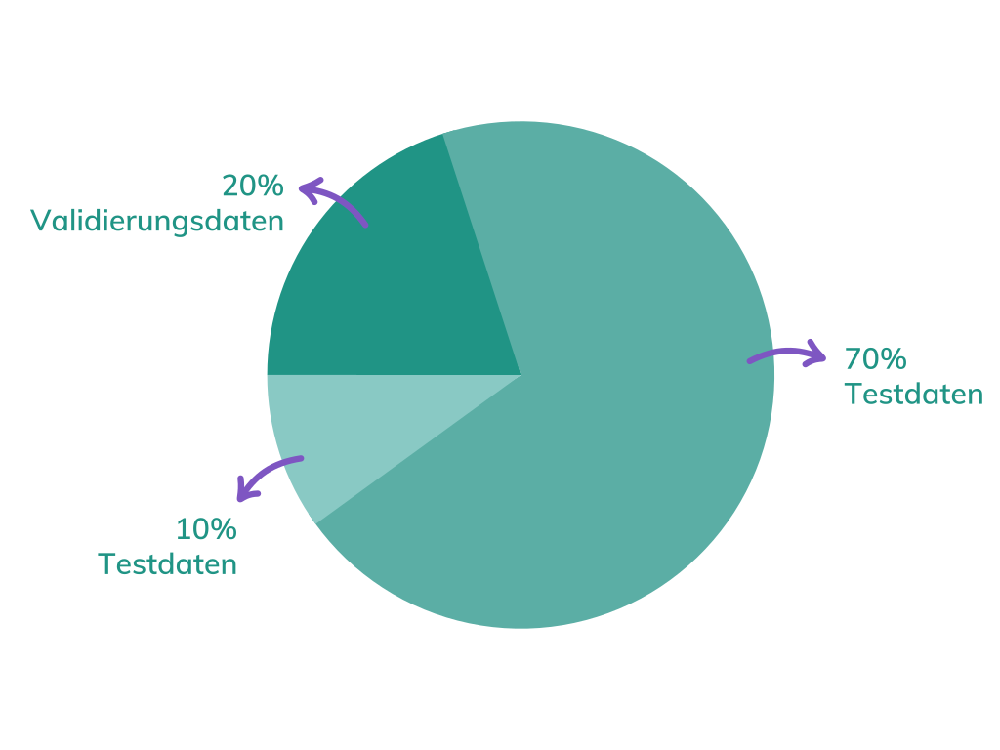

## **Über die Daten**
___________________________________________

Im Ordner `texte` befindet sich der Trainingstext [München 1611](https://hainhofer.hab.de/reiseberichte/muenchen1611?v={%22view%22:%22info%22}) sowie der Testtext [München 1603](https://hainhofer.hab.de/reiseberichte/muenchen1603) aus der digitalen Edition [**Philipp Hainhofer: Reiseberichte & Sammlungsbeschreibungen 1594 - 1636**](https://hainhofer.hab.de/). Die Texte wurden mit dem [Notebook `02_preprocessingText.ipynb`](https://github.com/easyh/NerDH/blob/main/notebooks/02_preprocessingText.ipynb) für den weiteren Prozess vorbereitet. 

---

Im Ordner `datensets` befinden sich die annotierten Datensets mit Goldstandard Anspruch. Annotiert wurden die Texte mit dem [NER Annotator for Spacy](https://tecoholic.github.io/ner-annotator/). `taggedData.json` umfasst den annotierten Text [München 1611](https://hainhofer.hab.de/reiseberichte/muenchen1611?v={%22view%22:%22info%22})  und `testData.json` den Testtext [München 1603](https://hainhofer.hab.de/reiseberichte/muenchen1603. 

Der NER Annotator for Spacy](https://tecoholic.github.io/ner-annotator/) exportiert die Daten in einem `JSON`-Format, die dann fürs Training noch ins passende `spaCy`-Format konvertiert werden müssen. Dieser Schritt wurd mit dem Notebook [`03_createDatasets_spacy.ipynb`](https://github.com/easyh/NerDH/blob/main/notebooks/03_createDatasets_spacy.ipynb) durchgeführt.

Die Verteilung der Datensets (`trainData.spacy`, `validationData.spacy`, `testData.spacy`) ist wie folgt: 

