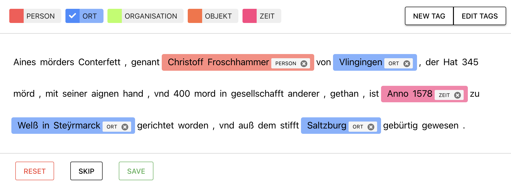

# **NER Tutorial am Beispiel deutscher historischer Texte**

Das NerDH-Tutorial ist im Rahmen einer Masterarbeit an der Universität Trier im Wintersemester 2022/23 entstanden. Das Thema der Arbeit war **Named Entity Recognition: Theorie und Anwendung der Technologie in den Digital Humanities am Beispiel historischer Texte**. Daraus leitet sich auch der Name des Tutorials ab: *NER* steht für die Abkürzung von Named Entity Recognition und *DH* für Digital Humanities. Im praktischen Teil der Arbeit wurde mit dem NER-Tool `spaCy` ein eigenes Modell für frühneuhochdeutsche Texte trainiert. 

??? Frühneuhochdeutsch question

    Die Periode des Frühneuhochdeutschen (Fnhd.) ist zwischen dem mittelalterlichen und neuzeitlichen Deutsch angesiedelt und erstreckt sich über einen Zeitraum von circa 1350-1650.[^1]

Ziel dieses Web-Tutorials ist es nun Interessierten grundlegende Kenntnisse in Bezug auf Named Entity Recognition sowie die praktische Anwendung eines NER-Tools zu vermitteln. Somit kann dieses Tutorial in zwei Teile gegliedert werden: [Theorie](index.md#1-was-ist-named-entity-recognition-ner) und [praktische Anwendung](tut.md). 

Der praktische Teil wird dabei neben einer Einführung in `spaCy` den Trainingsprozess des frühneuhochdeutschen NER-Modells erklären. Abgerundet wird das Web-Tutorial durch den [NerDH-Visualisierer](gui.md), welcher mit einer grafischen Benutzeroberfläche für eine einfache Ermittlung von Named Entities in deutschen (historischen) Texten sorgt.

 
 
**Viel Spaß und Erfolg mit dem Tutorial!** 
 

 

---

## **1. Was ist Named Entity Recognition (NER)?** 

`Named Entity Recognition (NER)` ist ein Textanalyse Verfahren des Natural Language Processing (NLP), welches sich mit der Identifizierung und Klassifizierung von benannten Entitäten (`Named Entities`) beschäftigt. Mit Entitäten werden Dinge der realen Welt bezeichnet, die einen Namen haben können. Die klassischen Entitäten in NER-Modellen sind: `PERSONEN`, `ORTE` und `ORGANISATIONEN`. 

!!! Beispiel ex

    

    <figure style="margin-bottom: 1rem">
    

    <mark class="entity" style="color: black; background: #ddd; padding: 0.45em 0.6em; margin: 0 0.25em; line-height: 1; border-radius: 0.35em;">
        Mia Müller
        PER
    </mark>
    wohnt in 
    <mark class="entity" style="color: black; background: #ff9561; padding: 0.45em 0.6em; margin: 0 0.25em; line-height: 1; border-radius: 0.35em;">
        Trier
        LOC
    </mark>
    und studiert an der 
    <mark class="entity" style="color: black; background: #7aecec; padding: 0.45em 0.6em; margin: 0 0.25em; line-height: 1; border-radius: 0.35em;">
        Universität Trier.
        ORG
    </mark>
    

    </figure>
    

## **2. Warum NER?** 

Der Einsatz von NER bedeutet eine enorme Zeitersparnis gegenüber der manuellen Annotation von Named Entities in Texten. NER ist nützlich, um Schlüsselinformationen aus Texten zu extrahieren. 

Zum Beispiel könnte NER genutzt werden, um die am häufigsten vorkommenden Figuren in einem Roman zu identifzieren oder ein Netz von Figuren zu erstellen. NER könnte aber auch verwendet werden, um die in Texten erwähnten geografischen Orte zu identifizieren, was der erste Schritt für die Kartierung von Orten wäre. Damit macht NER vor allem bei der Analyse von großen Textmengen Sinn, um Daten für weitere Analyseschritte zu erhalten. 

## **3. NER in den Digital Humanities**

Named Entity Recognition funktioniert besonders gut mit Zeitungsdaten - einfach aus dem Grund, weil die Systeme vor allem mit solchen Daten trainiert wurden. Allerdings wird NER auch in vielen anderen spezifischen Bereichen angewandt. Für die Digital Humanities wurden NER-Systeme besonders durch die massive Anzahl an digitalisierten historischen Dokumenten interessant.

Allerdings haben sich die Entwickler von NER-Modellen  beim Training haupsächlich auf moderne und englischsprachige Texte konzentriert. Besonders bei historischen Texten schneiden NER-Modelle nicht gut ab. Für die Digital Humanities ist es daher oft sehr herausfordernd mit aktuellen NER-Tools zu arbeiten, da man in den meisten Fällen nicht mit standardisierten und modernen Sprachen arbeitet. Meist - wie auch in diesem Tutorial - arbeitet man mit seltenen oder alten Sprachen. Bei einem solchen Textkorpus führen standardisierte NER-Modelle zu hohen Fehlerquoten. 

Herausfordernd ist dabei vor allem die Heterogenität der historischen Dokumente. Denn innerhalb eines Korpus
oder sogar eines Dokumentes sind verschiedene Sprachen (z.B. Deutsch, Latein, Französisch), eine 
uneinheitliche Schreibweise und Fehler in der Transkription durch Schreiber bzw. Texterkennungssoftware wie 
OCR vorfinden. Das folgende Bild stammt aus dem Annotationsprozess des **Goldstandards** für das Training mit dem frühhochneudeutschen Text und soll einen kleinen Einblick auf die uneinheitliche Schreibweise zeigen:  

??? Goldstandard question  

    Ein Goldstandard ist die finale Version der annotierten Daten, die für den Trainingsprozess verwendet werden. Je besser und genauer die Auszeichnungen für den Goldstandard gemacht werden, desto besser ist das Trainingsergebnis.

<figure markdown>
  { width="800" }
  <figcaption style="font-size: 0.8em;">Erstellung des Goldstandards für das Training. </figcaption>
</figure>

Wir sehen, dass hier besonders die Ortsnamen eine untypische Schreibweise im Vergleich zu deren heutiger aufweisen. Ebenso erkennen wir den Mix der verschiedenen Sprachen, da hier `Anno` verwendet wird, was lateinisch ist und `im Jahr` bedeutet. All diese Faktoren können die Genauigkeit von NER stark beeinflussen. 

Das Problem ist in den Digital Humanities bekannt. Vereinzelt wurden daher bereits auch schon experimentell Modelle und Untersuchungen mit deutschen historischen Texte trainiert und gemacht.[^2][^3][^4]

Genau das werden wir auch wir im [praktischen Teil](tut.md) des Tutorials angehen. 

## **4. Der NER-Prozess**

Der Named Entity Recognition Prozess lässt sich in zwei Schritte aufteilen:[^5]

1. **Extraktion von Entitäten:** In diesem Schritt scannt das NER-Modell die Daten und findet die Wörter, die als Entität behandelt werden können.  Ein NER-Modell ist in der Lage, die benannte Entität im Modell auf der Grundlage der ihm bekannten benannten Entitäten zu finden. 
2. **Klassifizierung von Entitäten:** Hier werden die Entitäten in vordefinierte Klassen kategorisiert, die benannte Entität `Trier` würde beispielsweise als `ORT` kategorisiert werden. 

Die meisten NER-Tools basieren auf Machine-Learning Algorithmen. Hier wird vorher eine Reihe von Merkmalen (Features) definiert, um eine möglichst präzise Erkennung möglich zu machen. Zum Beispiel können Wortlisten berücksichtigt werden, die alle Namen von Personen, Orten und Organisationen verzeichnet, die vorkommen könnten. Zusätzlich können auch Wörter mit einbezogen werden, die sich entweder vor oder nach der benannten Entität befinden. Weitere Merkmale könnten auch häufig vorher genannte Wörter sein, sowie zum Beispiel bei Orten das Wort `in`. Ein anderes erlernbares Muster könnte das Darstellungsformat bei Daten sein (z.B. 01.01.2023 oder 1. Januar 2023). Eine wichtige Rolle spielen auch Merkmale wie Groß- und Kleinschreibung sowie Positionen im Satz. Sämtliche Tools die es gibt, unterscheiden sich u.a. genau in diesem Punkt, der Anzahl der verschiedenen Merkmale.[^6] 

Mit Hilfe dieser im Tool vordefinierten Merkmale findet dann der überwachte Machine Learning Prozess statt. Der Lernprozess des NER-Tools besteht darin, dass diese Merkmale mit einem manuell annotierten Text (ein Teil des Goldstandards) abgeglichen werden, dem sogenannten Trainingskorpus. Das Ergebnis dieses Abgleichs ist dann das NER-Modell. Da Entitäten meist unterschiedliche Bedeutungen tragen können, führt nur die Kombination verschiedener Merkmale zu guten Ergebnissen. Das Tool errechnet anhand der Feature-Kombinationen und der Trainingsdaten, welche Zuordnung in welchem Kontext wahrscheinlicher ist.  

!!! info "Named Entity Linking & Beziehungsextraktion"

    Der Standardprozess kann allerdings noch um zwei weitere Schritte erweitert werden, die bei NER eine wichtige Rolle spielen:[^7] 
    
    -  **Disambiguation/Linking:** Hier wird den gefundenen Entitäten eine eindeutige Referenz wie z.B. ein Wikidata-Eintrag hinzufügt. In unserem Beispiel `Trier` als Entität `ORT`  würde der entsprechende Wikidata-Eintrag von Trier [`Q3138`](https://www.wikidata.org/wiki/Q3138) verlinkt werden.

    ??? question "Wikidata-Eintrag"

        Wikidata ist eine globale Wissensdatenbank, wo es für jeden Eintrag einen persistenten Identifikator (QID) gibt. 
        Für die Stadt Trier wäre der persistente Identifikator [`Q3138`](https://www.wikidata.org/wiki/Q3138). Hierdurch kann 
        eine Entität eindeutig identifiziert und verlinkt werden.
   
    -  **Beziehungsexktraktion:** In diesem Schritt können Beziehungen zwischen den benannten Entitäten hergestellt werden. 
    In einem Text werden möglicherweise Ortsnamen erkannt und als Named Entities markiert. Mit Beziehungserkennung kann dann untersucht werden, welche Beziehungen zwischen diesen Ortsnamen bestehen. Im Beispieltext `Trier ist eine Stadt in Deutschland und liegt in der Nähe der Grenze zu Luxemburg.` würden `Trier`, `Deutschland` und `Luxemburg` als Named Entities markiert. Durch die Beziehungserkennung könnte erkannt werden das `Trier` eine Stadt in `Deutschland` ist und `Deutschland` und `Luxemburg` Nachbarländer sind.

## **5. Übersicht über NER Tools**

Es gibt eine Vielzahl von vorhandenen NER-Tools. Meist wurden diese mit großen Korpora aus modernen journalistischen Texten trainiert. Speziell für die DH ist es daher wichtig, auf die Anwendungs- und Trainingsmöglichkeiten der Tools zu achten. Da wir im Tutorial nur mit dem Tool `spaCy` arbeiten werden, soll die folgende Tabelle einen Überblick über Tools bieten, die ebenfalls in den Digital Humanities zum Einsatz kommen. 

 

| Tool               | Beschreibung                                                   | Link |
| ------------------ | -------------------------------------------------------------- | ---- |
| `spaCy`            | Spacy ist ein leistungsstarkes Tool für die Verarbeitung natürlicher Sprache, das zur Verarbeitung großer Datenmengen eingesetzt wird. Mit Unterstützung für mehr als 64 Sprachen und 63 trainierten Pipelines für 19 Sprachen, ist es ein praktisches Tool für NLP. Das Trainieren einer eigenen Pipeline ermöglicht die Anwendung auf spezifische Texte. |[Link](https://spacy.io/)| 
| `NLTK`             | Das NLTK (Natural Language Toolkit) ist eine Reihe von Bibliotheken, die für NLP verwendet werden. Es wird häufig in der Forschung und für Bildungszwecke verwendet. Es ist in Python geschrieben und hat Zugang zu mehr als 50 Textkorpora in 7 Sprachen. |[Link](https://www.nltk.org/)| 
| `Stanford NER` |   Stanford NER ist eins der bekanntesten NER Tools unter Geisteswissenschaftlern, da es mehrere vortrainierte Modelle in verschiedenen Sprachen besitzt und eine Möglichkeit für die Erstellung von eigenen Modellen bietet.  |[Link](https://nlp.stanford.edu/software/CRF-NER.html#About)|  
| `HER`              | Das HER-Tool (Humanities Entity Recognizer) wurde speziell für die  Digital Humanities entwickelt. Es bietet eine Whitebox-Lösung für den robusten Umgang mit verschiedenen Arten von Entitäten, verschiedenen Sprachen, Stilen und Domänen sowie unterschiedlichen Strukturierungsebenen in Texten an.      |[Link](https://github.com/alexerdmann/HER/)| 
| `WebLicht`         |   WebLicht ist eine webbasierte Anwendung für automatische Annotation von Textkorpora, welche sowohl verschiedene Services für die Verarbeitung von Daten anbietet, als auch eine anwenderfreundliche grafische Oberfläche für die Verkettung von verschiedenen linguistischen Anwendungen. WebLicht bietet auch mehrere Pipelines für deutschsprachige NER an.     |[Link](https://weblicht.sfs.uni-tuebingen.de/weblichtwiki/index.php/Main_Page)| 
| `Flair`            | Flair ist eine leistungsstarke NLP-Bibliothek in einem PyTorch-Framework, welches es einfach macht, eigene Modelle zu trainieren und mit neuen Ansätzen zu experimentieren, die Flair-Einbettungen und -Klassen verwenden.     |[Link](https://github.com/flairNLP/flair)| 
| `TAGME`            | TAGME ist ein leistungsfähiges Werkzeug, das in der Lage ist, in einem unstrukturierten Text Entitäten zu identifizieren und sie auf schnelle und effektive Weise mit einer entsprechenden Wikipedia-Seite zu verknüpfen (Named Entity Linking).   |[Link](https://tagme.d4science.org/tagme/)| 
| `DBPedia`            | DPPedia ist ein Tool zur automatischen Annotation von DBpedia-Ressourcen in Texten und bietet eine Lösung für die Verknüpfung unstrukturierter Informationsquellen mit der Linked Open Data Cloud durch DBpedia (Named Entity Linking).   |[Link](https://www.dbpedia-spotlight.org/)| 

[^1]: Wikimedia Foundation. (2022). Frühneuhochdeutsche Sprache. Wikipedia. [https://de.wikipedia.org/wiki/Frühneuhochdeutsche_Sprache](http://web.archive.org/web/20230102125701/https://de.wikipedia.org/wiki/Fr%C3%BChneuhochdeutsche_Sprache)
[^2]: More, Jacqueline. Theorie und Anwendung von Named Entity Recognition in den Digital Humanities mit Fokus auf historische Texte des 17. Jahrhunderts (2021). [https://github.com/jackymore/NER_historical_texts](http://web.archive.org/web/20230102125804/https://github.com/jackymore/NER_historical_texts)
[^3]: Ehrmann, M., Hamdi, A., Pontes, E. L., Romanello, M., & Doucet, A. (2021). Named entity recognition and classification on historical documents: A survey. [https://arxiv.org/pdf/2109.11406.pdf](https://arxiv.org/pdf/2109.11406.pdf)
[^4]: Labusch, K., Kulturbesitz, P., Neudecker, C., & Zellhöfer, D. (2019). BERT for named entity recognition in contemporary and historical German. In Proceedings of the 15th conference on natural language processing (S. 9-11). [https://corpora.linguistik.uni-erlangen.de/data/konvens/proceedings/papers/KONVENS2019_paper_4.pdf](https://corpora.linguistik.uni-erlangen.de/data/konvens/proceedings/papers/KONVENS2019_paper_4.pdf)
[^5]: Aruja, M. P. (2022). Top 3 Packages for Named Entity Recognition - Quantrium.ai. Medium. [https://medium.com/quantrium-tech/top-3-packages-for-named-entity-recognition-e9e14f6f0a2a](http://web.archive.org/web/20230102125842/https://medium.com/quantrium-tech/top-3-packages-for-named-entity-recognition-e9e14f6f0a2a)
[^6]: Named Entity Recognition (NER) | forTEXT. (o. D.). [https://fortext.net/routinen/methoden/named-entity-recognition-ner](hhttp://web.archive.org/web/20230102120540/https://fortext.net/routinen/methoden/named-entity-recognition-ner)
[^7]: Ehrmann, M., Nouvel, D. & Rosset, S. (2016). Named Entity Resources - Overview and Outlook. Language Resources and Evaluation. [https://hal-inalco.archives-ouvertes.fr/hal-01359441/document](https://hal-inalco.archives-ouvertes.fr/hal-01359441/document) 
